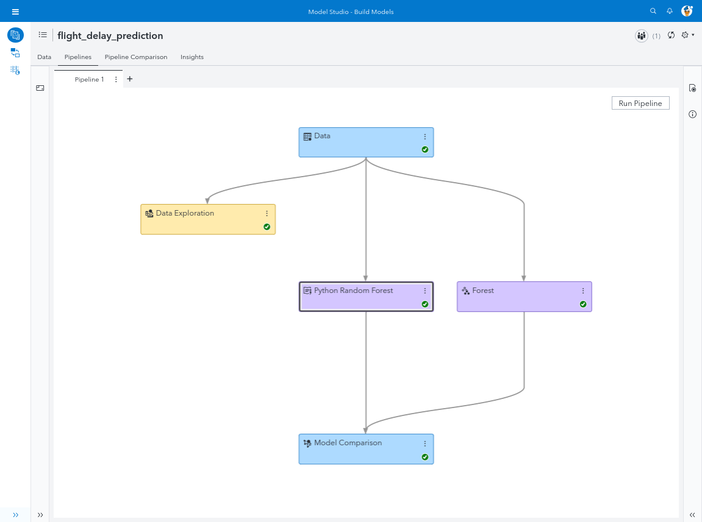

# SAS Model Studio Pipelines with Python Integration
  
 
SAS Viya is perfect for analyzing large data and if you want to use a visual interface I highly recommend SAS Model Studio with its pipeline interface. 
In this example I demonstrate how to perform modelling on structured data with SAS Model Studio. 
The pipeline consists of a SAS Random Forest and a Python Random Forest. At the end we are comparing both models to find out which one is the champion. 
Our goal is to predict flight delays given historical flight data. 

### Official Repository
The official SAS repository with more examples can be found here:
* [SAS Viya Model Studio Pipelines](https://github.com/sassoftware/sas-viya-dmml-pipelines)
