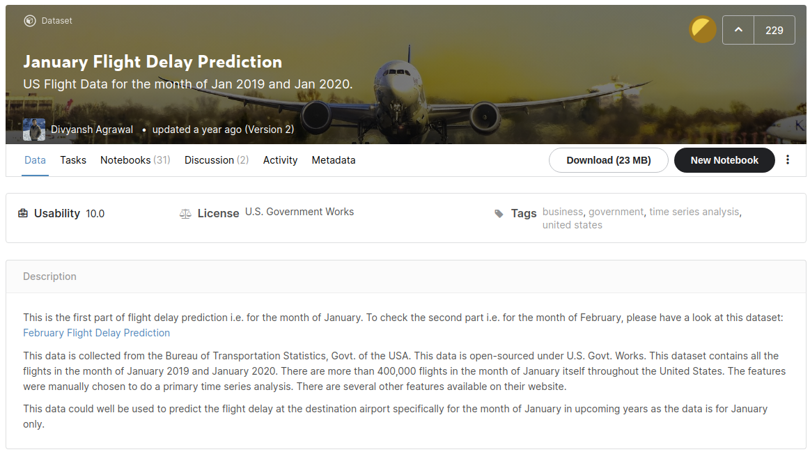

# SAS Analytics with Python API
  
 
SAS Viya is perfect for analyzing large data and if you want to use familiar Python-syntax you should try SAS SWAT. 
In this example I demonstrate how to perform basic data loading, exploration and modelling on structured data with SAS SWAT. 
Our goal is to predict flight delays given historical flight data. 

### Official Repository
The official SAS SWAT repository with more examples can be found here:
* [SAS Scripting Wrapper for Analytics Transfer (SWAT)](https://github.com/sassoftware/python-swat)

### Further Ressources
There is a well written book called "SAS Viya: The Python Perspective" which I highly recommend. 
This book describes in 10 chapters everything you need to know about working with SAS SWAT. 
In their GitHub repository you'll find all the codes from their book for free. 
[SAS Viya: The Python Perspective](https://github.com/sassoftware/sas-viya-the-python-perspective)
